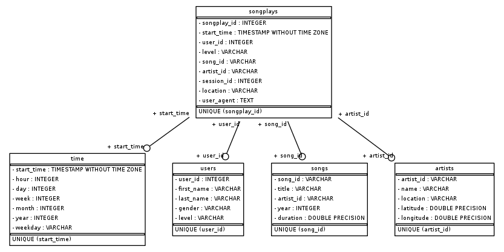

## Project: Data Warehouse
### Project description
A music streaming startup, Sparkify, has grown their user base and song database and want to move their processes and data onto the cloud. Their data resides in S3, in a directory of JSON logs on user activity on the app, as well as a directory with JSON metadata on the songs in their app.

As their data engineer, my task is building an ETL pipeline that extracts their data from S3, stages them in Redshift, and transforms data into a set of dimensional tables for their analytics team to continue finding insights into what songs their users are listening to. 

### Database design
Using the song and log datasets, I create a star schema optimized for queries on song play analysis. This includes one fact table (songplays) and 4 dimension tables (users, songs, artists and time). Folowing is the information about the sparkify database schema and tables. 
1. The fact table - songplays contains all the information about records in log data associated with song plays. This table has 9 columns songplay_id, start_time, user_id, level, song_id, artist_id, session_id, location, user_agent.
2. Dimension users table contains information about users in the app like user_id, first_name, last_name, gender, level
3. Dimension songs table has information of all songs in music database like song_id, title, artist_id, year, duration
4. Dimension artists table has information of all artists in music database, including artist_id, name, location, latitude, longitude
5. Dimension time table contains timestamps of records in songplays broken down into specific units: start_time, hour, day, week, month, year, weekday

### ETL Process
Sparkify data consist song dataset and log dataset that resides in S3 bucket. Song dataset is stored in 's3://udacity-dend/song_data' directory which consist of multiple files in JSON format contain metadata about song and artist of that song. The files are partitioned by the first three letters of each song's track ID. This dataset will be extracted and loaded into staging_songs table in Redshift.
The second dataset consists of log files in JSON format generated by this event simulator based on the songs in the dataset above. These simulate activity logs from a music streaming app based on specified configurations.The log files in the dataset are partitioned by year and month and is stored in 's3://udacity-dend/log_data' directory. Data from this dataset will be extracted and inserted into staging_events table in Redshift.
Finally, data from staging_songs and staging_events tables will be selected and inserted into dimensional and fact tables, namely: users, songs, artists, time and songplays.

### Project Repository files
There are 4 main files in repo directory of this project. The sql_queries.py contains all the SQL queries to drop, create, insert data from staging to dimensional tables. The create_tables file will be used to connect to Redshift then then implemente the SQL queries that is imported from the sql_queries.py file like drop tables if exist, create staging and dimensional tables. The etl.py is build to copy data from S3 bucket into staging tables in Redshift then insert data from staging tables into dimension and fact tables. In addition, there is one configure file which contains all information about the Redshift cluster congfiguration, IAM role and S3 bucket.

### How To Run the Project
To run the ETL pipeline, open new Console then import create_tables, etl modules. Then run create_tables module (create_tables.main()) to create database, tables, once run successfull we will run etl module (etl.main()).

### Example analytics queries
When the etl process is completed, we can connect to dev database to run some following queries to check whether the data is properly loaded to the demensional data or not:

 - SELECT count(*) as user_num FROM users;
 - SELECT count(*) as artist_num FROM artists;
 - SELECT count(*) as song_num FROM songs;
 - SELECT count(*) as time_event_num FROM time;
 - SELECT count(*) as songplay_num FROM songplays;
