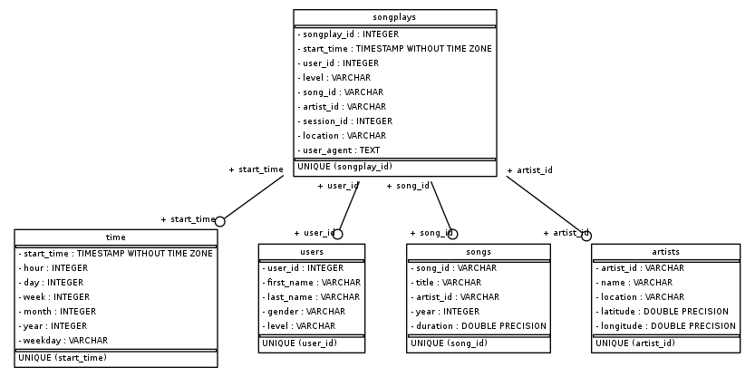

## Project: Data Lake
### Project description
A music streaming startup, Sparkify, has grown their user base and song database even more and want to move their data warehouse to a data lake. Their data resides in S3, in a directory of JSON logs on user activity on the app, as well as a directory with JSON metadata on the songs in their app.

As their data engineer, I will build an ETL pipeline that extracts their data from S3, processes them using Spark, and loads the data back into S3 as a set of dimensional tables. This will allow their analytics team to continue finding insights in what songs their users are listening to.

To complete the project, I will need to load data from S3, process the data into analytics tables using Spark, and load them back into S3. You'll deploy this Spark process on a cluster using AWS.

### Database design
Using the song and log datasets, I create a star schema optimized for queries on song play analysis. This includes one fact table (songplays) and 4 dimension tables (users, songs, artists and time). Folowing is the information about the sparkify database schema and tables. 
1. The fact table - songplays contains all the information about records in log data associated with song plays. This table has 9 columns songplay_id, start_time, user_id, level, song_id, artist_id, session_id, location, user_agent.
2. Dimension users table contains information about users in the app like user_id, first_name, last_name, gender, level
3. Dimension songs table has information of all songs in music database like song_id, title, artist_id, year, duration
4. Dimension artists table has information of all artists in music database, including artist_id, name, location, latitude, longitude
5. Dimension time table contains timestamps of records in songplays broken down into specific units: start_time, hour, day, week, month, year, weekday

### ETL Process
Sparkify data consist song dataset and log dataset that resides in S3 bucket. Song dataset is stored in 's3://udacity-dend/song_data' directory which consist of multiple files in JSON format contain metadata about song and artist of that song. The files are partitioned by the first three letters of each song's track ID. This dataset will be loaded and processed data into analytics songs and artists tables then wrote into S3 by using Spark.

The second dataset consists of log files in JSON format generated by this event simulator based on the songs in the dataset above. These simulate activity logs from a music streaming app based on specified configurations.The log files in the dataset are partitioned by year and month and is stored in 's3://udacity-dend/log_data' directory. This dataset will be loaded and processed data into analytics usersand time tables. The log data will be joined with song data to generate the songplays table. Then those tables will be wrote into S3.

### Project Repository files
There are 2 main files in repo directory of this project. The etl.py is built to load data from S3 bucket and process data into analytics tables then write those tables into S3 by using Spark. In addition, there is one configure file which contains information about the IAM user to access AWS.

### How To Run the Project
To run the ETL pipeline, open new Console then import etl module. Then run etl module (etl.main()).
