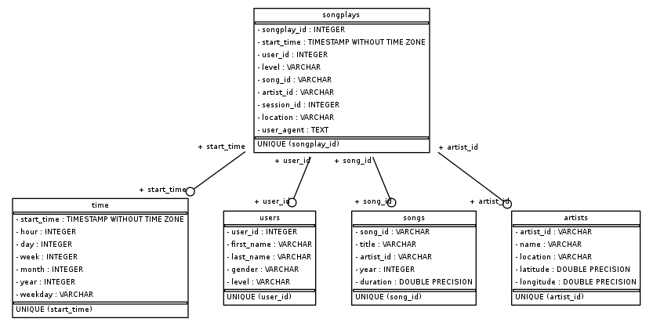

# Project: Data Pipeline
This project is working on data infrastructure of a music streaming startup, Sparkify. I created  a set of automating data pipeline by using Apache Airflow. The pipeline extract raw datasets from S3 to staging tables in Redshift, then transform and load data from staging tables into dimensional tables. 

### Database Schema

### Project Repository files
In this project, there are 2 folders which are dags and plugins. dags folder contains udac_example_dag.py create_tables.sql and README.md files. While udac_example_dag.py is the main file in this project which is used to auto scheduling ETL process, create_tables.sql is used for creating destination tables in Redshit. In addition, the plugins folder contains all the custom operators and sql queries which will be used by the data pipeline.

### How to Run the Project
1. Create a Redshift cluster on AWS account
2. Using queries in the create_tables.sql to create tables in the Redshift
3. Turn on Airflow by running /opt/airflow/start.sh
4. Create AWS and Redshift connections on Airflow Web UI
5. Run udac_example_dag to trigger data pipeline

